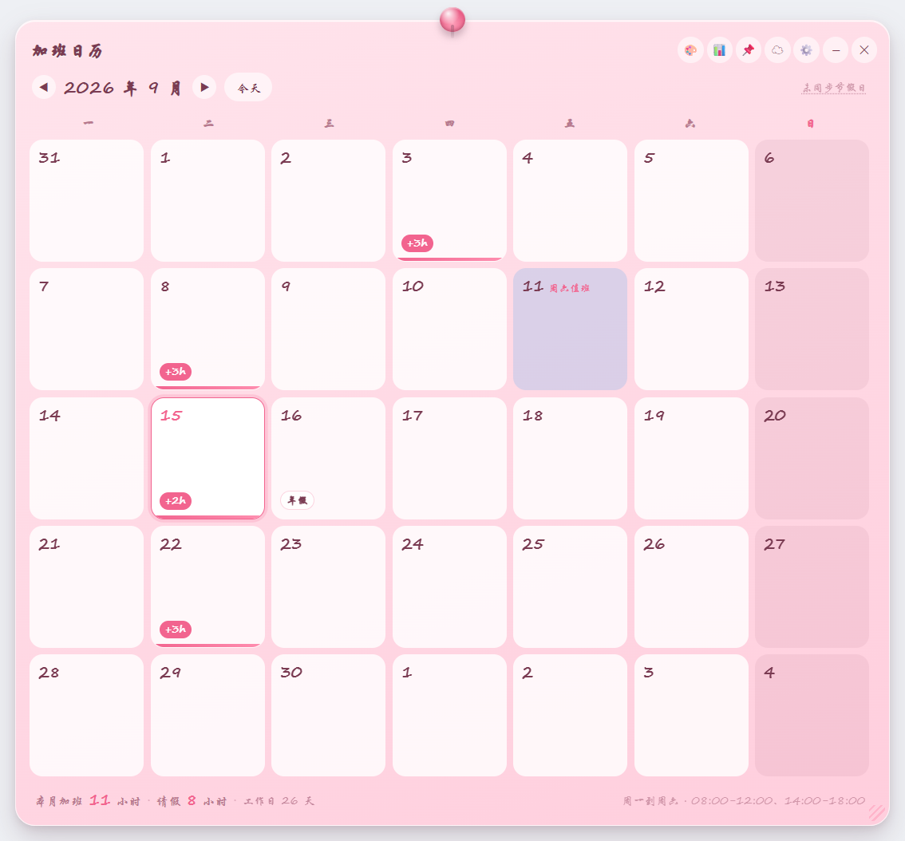
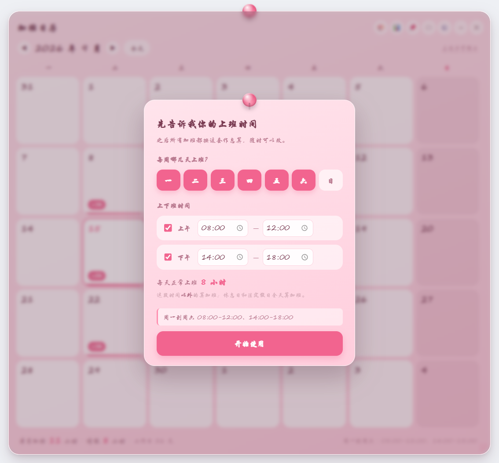
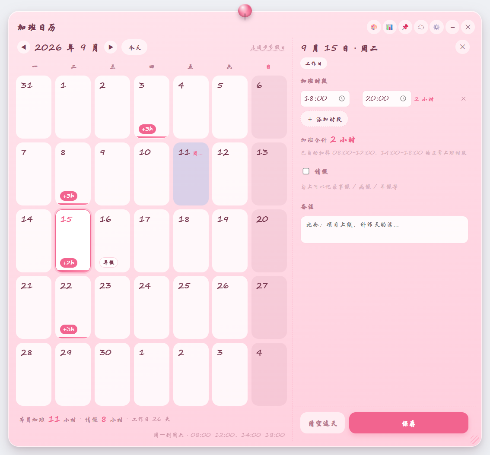
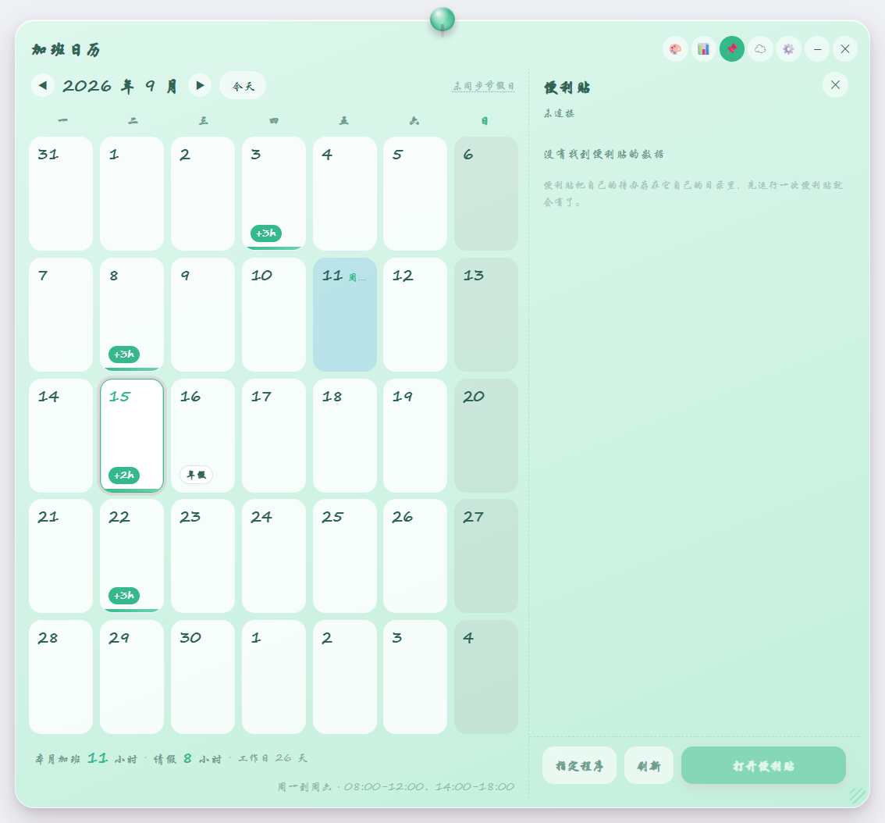
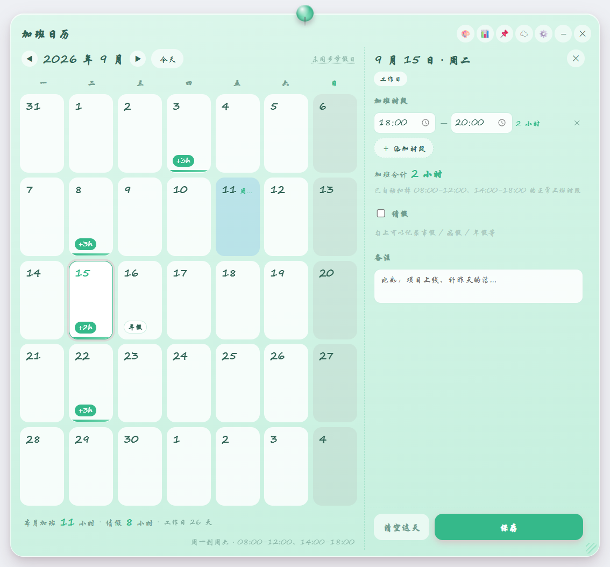

# Overtime Calendar 📅

> [中文](README.md) ｜ **English**

A month-grid overtime tracker. Tap a day, enter the hours you actually worked, and let it do the math.



## Features

- 🗓 **Month grid** — see a whole month at a glance, spot the overtime days instantly
- ⚙️ **First-run wizard** — set which weekdays you work and your morning / afternoon hours
- 🧮 **Automatic clipping** — you enter the time you *worked*; your normal shifts get subtracted for you
- 🇨🇳 **Holiday sync** (optional) — pulls Chinese public holidays and make-up workdays, with three fallback sources
- 📊 **Excel export** — monthly detail plus totals, saved as `.xlsx`
- 📌 **Sticky Notes integration** — read your Sticky Notes to-dos and launch the app from here
- 🎨 **5 macaron palettes** — strawberry / mint / lavender / lemon / blueberry
- ✨ **Little animations** — sliding month transitions, staggered cell fade-in, today's pulsing halo

## Screenshots

| Month view | First-run wizard |
| --- | --- |
|  |  |

| Day editor | Sticky Notes panel |
| --- | --- |
|  |  |

Another palette (mint):



## Quick start

```bash
git clone <your-repo-url>
cd overtime-calendar
npm install
npm run dev
```

> Requires Node 18+. `npm run dev` starts Vite and Electron together; renderer changes hot-reload.

## First run

The first launch shows a wizard asking three things:

1. **Which weekdays you work** — click to toggle, defaults to Monday–Saturday
2. **Morning hours** — start and end
3. **Afternoon hours** — start and end

Hit “Start” and it's saved. Don't want to fill it in now? Click “Use defaults”. To change it later, click the **⚙️** button in the top-right; changes take effect immediately and **already-recorded overtime is recalculated against the new schedule**.

## Work rules

Your schedule is **yours to define**; the rules themselves are fixed:

| Item | Rule |
| --- | --- |
| Workdays | The weekdays you picked (default Mon–Sat) |
| Normal hours | Your morning + afternoon blocks (default 08:00-12:00, 14:00-18:00) |
| Overtime | Any time **outside** your normal hours |
| Rest day | A day you didn't pick — **the whole day counts as overtime** |
| Public holiday | Day off — **the whole day counts as overtime** |
| Make-up workday | Treated as an ordinary workday |
| Leave | Recorded separately, never folded into overtime |

The currently active schedule is always shown at the right of the summary bar, so you never have to open settings to check what rules are being applied.

### Automatic clipping

You enter **the time you were working**; the app subtracts your normal shifts. Examples use the default schedule (08:00-12:00, 14:00-18:00):

| You enter | Counted as overtime | Why |
| --- | --- | --- |
| Thu `18:00-21:30` | **3 h 30 m** | Entirely outside normal hours |
| Thu `17:00-20:00` | **2 h** | 17:00-18:00 is a normal shift |
| Thu `07:00-09:00` | **1 h** | 08:00-09:00 is a normal shift |
| Thu `09:00-11:00` | **0** | Fully inside normal hours |
| Sun `09:00-18:00` | **9 h** | Rest days aren't clipped |

> The lunch break (12:00-14:00 by default) sits outside your normal hours, so if you enter it, it counts as overtime — entering it means “I was working then”.
>
> With a custom schedule the clipping follows automatically: change to a single 09:00-18:00 block and 08:00-09:00 plus anything after 18:00 becomes overtime, while 12:00-13:00 no longer does.

## How to use

1. **Click any day** → the editor slides in from the right
2. In the editor you can set:
   - **Overtime segments** — up to 6; each shows its clipped duration live, and ones that compute to 0 are greyed out with “not overtime”
   - **Leave** — tick it, choose a type (personal / sick / annual / compensatory / marriage / maternity / other) and hours
   - **Note** — e.g. “release day”
3. Click **Save**; click **Clear this day** to wipe it
4. The bottom bar shows the month totals: overtime hours, leave hours, workday count

**Reading a cell:**

- White = workday, light pink = rest day, deep pink = public holiday, light blue = make-up workday
- Pink pill `+3h` = overtime that day
- White pill `年假` = leave that day
- Red label on the cell (e.g. `国庆节`) = holiday name
- The one with a pulsing halo is today

## Holiday sync (optional)

**Works fully offline** — by default it only follows the schedule you set.

To make it aware of public holidays and make-up workdays, click **☁** in the top-right. It fetches the current year from:

1. **jsDelivr** hosting of the `holiday-cn` dataset (fast in mainland China)
2. falls back to the same data on **GitHub Raw**
3. falls back again to the **timor.tech** API

The data is cached locally, so it keeps working offline afterwards. Once synced, the calendar labels days like “国庆节” or “春节调休”, and the overtime rules for those days follow suit.

> The data is a community-compiled summary of official State Council announcements; re-sync when a new year starts.

## Colour themes

Click **🎨** to cycle through 5 macaron palettes: strawberry / mint / lavender / lemon / blueberry.

The paper, text, overtime pills, holiday tints, pin and buttons all follow, and your choice is remembered.

## Excel export

Click **📊** to export the current month as `.xlsx`:

- Columns: date / weekday / day type / overtime segments / overtime duration / leave type / leave hours / note
- **Only days with records are exported** — blank days don't waste rows
- A **totals** row is appended (workdays, total overtime, total leave)
- Frozen header with a soft pink fill

You pick the save location; it defaults to your Documents folder with a name like `加班记录-2026-09.xlsx`.

> Overtime is **computed in the renderer** and handed to the main process, which only lays the rows into the sheet. That guarantees the exported numbers always match what you see in the UI — two separate implementations of the same rules would eventually disagree, and that's painful to debug.

## Sticky Notes integration

Click **📌** to open the Sticky Notes panel:

| Ability | Description |
| --- | --- |
| **Read** | Finds your Sticky Notes to-dos and shows them in “open / done” groups |
| **Launch** | “Open Sticky Notes” button starts the app |
| **Locate** | “Choose app” lets you point at the `.exe`; the path is remembered |
| **Refresh** | Re-reads after you change something over there |

It tries three locations in order and uses the first one that has data:

```
%APPDATA%\马卡龙便利贴\sticky-note-state.json    ← standalone Sticky Notes
%APPDATA%\macaron-sticky-notes\...              ← standalone (dev build)
%APPDATA%\马卡龙套件\suite-state.json            ← the suite's Sticky Notes module
```

> Sticky Notes data is **read-only** — the calendar never modifies your to-dos.
>
> If none of the three exists, the panel says “not connected” and explains how to set it up. It won't error out.

## Animations

- Month change: the whole grid slides in the direction you navigated
- Month enter: 42 cells fade in with a staggered delay, like dominoes
- Hover: cells lift slightly and scale to 103.5%
- Click: press-and-bounce
- Today: a slowly expanding halo
- Overtime pill: pops in
- Editor: slides in from the right while the calendar narrows
- Saved: a toast pill floats up from the bottom

## Architecture

The Electron main process owns data and networking; the renderer just draws.

```
Renderer (Vue 3 + SCSS)             Main process (Electron)
  │                                   │
  │  tap a day → enter hours          │
  │ ──── IPC: cal:save-day ─────────► │  validate + persist
  │                                   │
  │ ──── IPC: cal:sync-holidays ────► │  net.fetch, three sources in turn
  │ ◄─── holiday data ─────────────── │  cached locally
  │                                   │
  │  overtime math (pure, worktime.js)│
```

**The overtime math is pure functions** in `src/shared/worktime.js` with no Electron dependency, so it runs directly under Node:

```bash
npm test
```

34 assertions cover segment clipping, lunch-break handling, rest days, **custom schedules**, dirty-data filtering, leap-year grids and monthly summaries.

### Project layout

```
overtime-calendar/
├── index.html
├── vite.config.mjs
├── electron/                 main process
│   ├── main.js               window + IPC
│   ├── preload.js            contextBridge
│   ├── store.js              state read/write + validation
│   ├── holidays.js           holiday sync (three sources)
│   ├── export-excel.js       xlsx export (layout only; math done in renderer)
│   ├── sticky-link.js        reads Sticky Notes data
│   └── icon.html             icon canvas
├── scripts/
│   └── test-worktime.mjs     overtime math unit tests
├── docs/                     screenshots
└── src/                      renderer
    ├── App.vue               layout & state orchestration
    ├── shared/
    │   └── worktime.js       ★ work rules & math
    ├── components/
    │   ├── CalendarGrid.vue  month grid + transition
    │   ├── DayCell.vue       a single day cell
    │   ├── DayEditor.vue     right-hand editor (day)
    │   ├── StickyPanel.vue   right-hand panel (Sticky Notes)
    │   ├── SetupWizard.vue   first-run wizard / edit schedule
    │   └── SummaryBar.vue    monthly summary
    └── styles/
        ├── _tokens.scss      macaron palette tokens
        └── base.scss         global styles
```

## Scripts

```bash
npm run dev      # develop (Vite HMR + Electron)
npm test         # overtime math unit tests (34)
npm run build    # build to dist/
npm start        # build, then run in production mode
npm run smoke    # self-check: UI mount + round-trip + wizard flow + export + sync
npm run shot     # screenshots into .shots/
npm run icon     # regenerate the icon
npm run dist     # package a Windows exe
```

## Packaging

```bash
npm run dist
```

Output lands in `release/`:

| File | Description |
| --- | --- |
| `OvertimeCalendar-Setup-1.0.0.exe` | Installer |
| `OvertimeCalendar-Portable-1.0.0.exe` | Portable |
| `win-unpacked\加班日历.exe` | Unpacked folder |

> Packaging output goes to `release/`, not `dist/` — `dist/` belongs to Vite and reusing the name makes the two builds overwrite each other.

## Where the data lives

```
%APPDATA%\加班日历\calendar-state.json
```

It holds the window position, **your schedule**, daily overtime/leave records and the synced holidays. Delete it to start over (the wizard will show again next launch).

## Gotchas

Notes to self from building this:

- **Vue reactive objects can't cross IPC.** What `ref` / `reactive` hands you is a **Proxy**, and passing it to `ipcRenderer.invoke` throws `An object could not be cloned`. Worse, if that exception isn't caught the UI just shows **a button that does nothing** — brutal to debug. Every cross-process argument now goes through `toPlain()` (`JSON.parse(JSON.stringify())`). **Both “Start” and “Save day” were bitten by this.**
- **A full-screen overlay covers the title bar too.** The wizard overlay used to be `inset: 0`, which made the ✕ unreachable — users got **stuck in the dialog** and had to kill the process from Task Manager. The overlay now starts at `top: 54px`, and first-run also offers a “use defaults” escape hatch.
- **Regression tests need real mouse events.** `element.click()` bypasses hit-testing and dispatches directly, so it can't catch “the button is covered by something”. Switching to `webContents.sendInputEvent` is what exposed the overlay bug — both of these only surfaced after adding UI-level tests.
- **“Tests ran but produced no output”**: `requestSingleInstanceLock()` makes a second instance **exit silently** (exit 0, doing nothing). If the app is already running, `npm run smoke` / `npm run shot` print nothing at all and look hung. Self-check mode now uses its own userData so it never competes for the lock.
- **A BOM makes `JSON.parse` throw.** Files written by PowerShell's `Set-Content -Encoding UTF8` carry a BOM, which broke reading the Sticky Notes data. Readers now strip it with `.replace(/^\uFEFF/, '')`.
- **The pin got clipped**: the paper uses `overflow: hidden` (so inner scrolling is clipped by the rounded corners), but the pin's `top` is negative to poke above the paper — so it was clipped away entirely and looked like the pin had vanished. The pin now lives **outside** the paper, positioned by the outer container.
- **Day numbers got clipped**: handwritten fonts (Segoe Print / KaiTi) have taller glyphs than usual; `line-height: 1.1` plus `overflow: hidden` cut off the bottom. It needs 1.3.
- **`<input type="time">` width**: leave room for the clock icon — “18:00” needs at least 92px, otherwise it renders as “18:0(”.
- **Node ESM warning**: `worktime.js` is ESM but `package.json` doesn't declare `"type": "module"` (doing so would break `require` in the Electron main process). The test script suppresses the warning with `--disable-warning=MODULE_TYPELESS_PACKAGE_JSON`.
- **Vite must bind IPv4 explicitly**: the default `localhost` may resolve to `::1`, while `wait-on` in the dev script waits on `127.0.0.1` — the mismatch means Electron never starts.

## Known limitations

- Packaging targets Windows only (`nsis` + `portable`). For macOS / Linux, swap `build.win` in `package.json` for the target platform; the code itself is cross-platform.
- The Sticky Notes integration relies on Windows `%APPDATA%` paths and `.exe` launching, so it needs rework on other platforms.
- Holiday data comes from a community-maintained dataset and isn't guaranteed to match official announcements exactly.

## License
[MIT](LICENSE)
